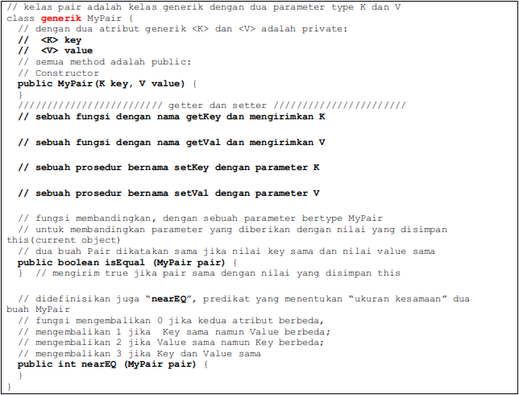

Implementasi kerangka kelas generik Java sebagai berikut dengan “templates”, yang mengandung dua parameter type K dan V sebagai atribut

Anda hanya diminta untuk submit MyPair.java yang akan dinilai oleh driver sistem

